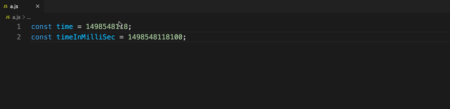

# Timestamp Helper

更好地显示和操作时间戳。[English Version](./README.md)

### 功能

- 悬停显示可阅读的时间格式（支持自定义格式）
- 根据数字位数自动猜测秒或毫秒单位
- 通过命令修改或添加时间戳

### 悬停显示

定制显示格式，配置项：`timestamp-helper.format` 默认值 `YYYY-MM-DD HH:mm:ss`, 定制格式可以参考[dayjs文档](https://dayjs.gitee.io/docs/zh-CN/display/format)

### 修改时间戳

* 命令 `transfer timestamp`
* 快捷键 `alt+t alt+t`

#### 例子

- 修改时间戳到1天5小时3分之后 `1d5h3m later`
- 插入某个时间点的时间戳 `$2020-09-12 08:09:26` (默认插入的时间戳是毫秒单位，使用`$`可改成秒) 
- 插入某个UTC时间点的时间戳 `%2020-09-12 08:09:26`
- 插入相对于当前1个星期加5小时之前的时间 `1w5h ago from now`

#### 输入格式

* 格式组成 `<前缀?><主体> <时间状词?>`

前缀：`$` 指定以秒为单位，`@` 指定以毫秒为单位，`%` 指定输入为 UTC 时间。

主体：如果没有提供时间状词，使用`dayjs`格式化主体，并输出对应的时间戳；如果提供了时间状词，则主体的格式是连续的`数字+字母单位`组合，如`1Y2M10d4h3s`, 具体的字母单位含义：`Y`年，`M`月，`w`周，`d`天，`h`时，`m`分，`s`秒，`S`毫秒

时间状词：支持 `after/later/ago/before`，后面可以跟`from now`表示计算的起点是当前系统时间，`after/later`表示相对于参考时间之后，`ago/before`相对于参考时间之前。

* 特殊字

`now` -- 当前时间    

`a few moments later` -- 当前时间之后的一个随机时间
